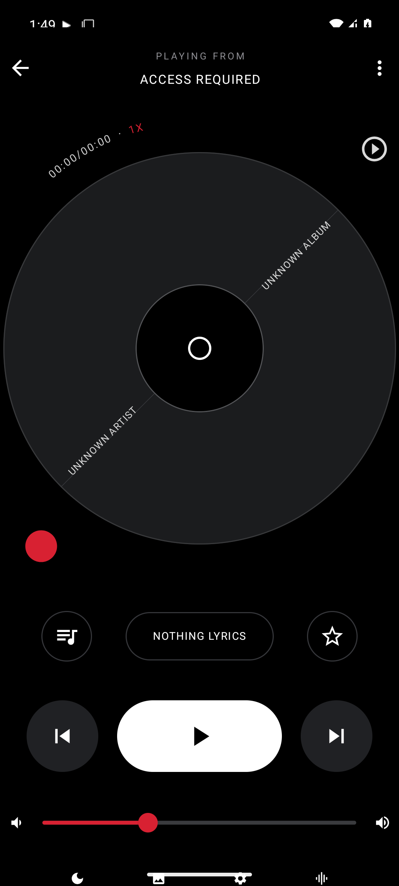

# NothingLyrics

A now-playing lyric display app for **Nothing Phone (3a)** — shows live synced lyrics on your home screen, in a full-screen AOD-style lyrics view, inside Android Auto, and drives the phone's **Glyph lights in rhythm with the beat**.



## Features

### 🎵 Live lyric detection
- Detects whatever is playing via the **Notification Listener Service** (Spotify, YT Music, and any app with a media notification).
- A foreground **MusicDetectionService** keeps detection alive and pumps track title, artist, album, artwork, playback state, and real elapsed/duration time into the UI.
- Falls back to a **manual lyric search** (LRCLIB) if a track can't be matched automatically.

### 🎤 Synced lyrics (LRCLIB)
- Fetches time-synced `.lrc` lyrics from the **LRCLIB API** when a track changes.
- Lyrics stay in sync with playback position, auto-scrolling to the current line.

### 📺 AOD / Lyrics-Only mode
- Tap the moon icon (or the screen in full-screen mode) for a landscape, black, always-on style **lyrics-only view**.
- The current line is centered and bold; past/upcoming lines are dimmed and smaller.
- Optional **drifting, blurred album art** panel beside the lyrics.
- Adjustable **lyric color** (White / Red / Ice) and **font size** (22–42 sp) in Settings.

### 💡 Glyph Song (Phone 3a)
- Uses the **Nothing Glyph Developer Kit** (`glyph-matrix-sdk`, device 24111) to drive all 36 Glyph channels.
- Analyzes the **audio spectrum** (Visualizer) for real-time **beat detection** and energy, then animates a light wave across the Glyph matrix **in rhythm with the song**.
- Runs only on the actual Phone (3a) hardware; on other devices it shows a preview indicator in the app.

### 🚗 Android Auto
- Exposes a **Media3 MediaLibraryService** that publishes the current lyric line, next line, and artwork as the "Now Playing" metadata for the car screen.
- **Transport controls (play/pause/next/previous) are forwarded** to the real music app you're listening to — no more dead buttons or laggy seek jumps.

### 🏠 Home screen widget
- Small home-screen widget showing **current track, artist, and the next two lyric lines**, updated live.
- Tap it to jump back into the app.

### 🎛 Main screen
- Spinning vinyl-disc look with album art, progress ring, and a curved time/playback-speed label.
- Real transport controls (previous / play-pause / next) that control the actual music app.
- **Real device volume slider** wired to `STREAM_MUSIC` (not a fake control).
- Status row shows the detection method (media session / notification access).

## Screenshots

| Main screen |
|:---:|
|  |

## Build

Requirements: JDK 21, Android SDK with `platforms;android-36`.

```bash
gradlew assembleDebug
```

The debug APK is signed with a consistent debug keystore and comes out at:

```
app/build/outputs/apk/debug/app-debug.apk
```

> Note: the build uses a `debug.keystore` at the repo root (git-ignored) for a consistent, re-installable signature.

## Permissions

| Permission | Why |
| --- | --- |
| `BIND_NOTIFICATION_LISTENER_SERVICE` | Read media notifications to detect the current song |
| `POST_NOTIFICATIONS` | Show the ongoing detection notification |
| `RECORD_AUDIO` | Audio spectrum capture for beat-synced Glyph animation |
| `FOREGROUND_SERVICE` / `MEDIA_PLAYBACK` | Keep the detection service alive |

## Compatibility

- **Glyph lights:** Nothing Phone (3a) only
- **Lyrics, widget, AOD mode, Android Auto:** any Android 8.0+ (API 26+) device

## Tech stack

- Kotlin + Jetpack Compose (Material 3)
- OkHttp + Gson (LRCLIB API)
- Media3 ExoPlayer + Session (Android Auto integration)
- Nothing Glyph Developer Kit (`com.nothing:glyph-matrix-sdk:2.0`)
- Android Visualizer for real-time beat detection
